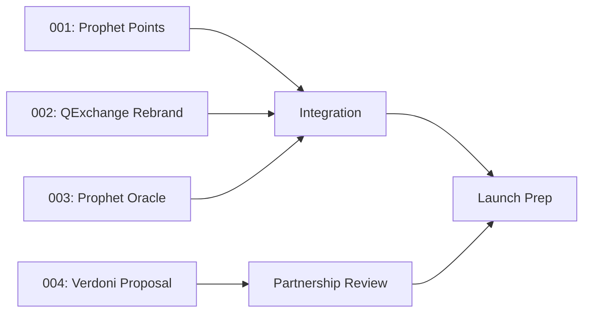

# Prophet Ecosystem Orchestrator

A multi-agent coordination system for building the Prophet platform.

## Architecture

```
prophet-orchestrator/
├── ORCHESTRATOR.md          # This file - coordination hub
├── STATUS.json              # Machine-readable status tracking
├── tasks/
│   ├── 001-prophet-points.md
│   ├── 002-qexchange-rebrand.md
│   ├── 003-prophet-oracle.md
│   └── 004-verdoni-proposal.md
└── outputs/
    └── (generated artifacts)
```

## Workstream Status

| ID | Task | Agent | Status | Progress | Blocking |
|----|------|-------|--------|----------|----------|
| 001 | Prophet Points System | Unassigned | 🔴 Not Started | 0% | None |
| 002 | QExchange Rebrand | Unassigned | 🔴 Not Started | 0% | None |
| 003 | Prophet Oracle AI | Unassigned | 🔴 Not Started | 0% | None |
| 004 | Verdoni Proposal | Unassigned | 🔴 Not Started | 0% | None |

## Dependency Graph



## Execution Commands

To start all workstreams in parallel:
```
# Agent A: Prophet Points
cd /Users/letstaco/Documents/QCrypto\ Channel
# Execute tasks/001-prophet-points.md

# Agent B: QExchange Rebrand  
cd /Users/letstaco/Documents/QExchange
# Execute tasks/002-qexchange-rebrand.md

# Agent C: Prophet Oracle
cd /Users/letstaco/Documents/QCrypto\ Channel
# Execute tasks/003-prophet-oracle.md

# Agent D: Verdoni Proposal
# Execute tasks/004-verdoni-proposal.md
```

## Coordination Protocol

1. **Status Updates**: Each agent updates STATUS.json after completing milestones
2. **Blocking Issues**: Tag with `BLOCKED:` and reason in status
3. **Integration Points**: Defined in task specs, require orchestrator review
4. **Conflicts**: File-level conflicts resolved by orchestrator

---

*Last Updated: 2026-01-19T11:05:10*
